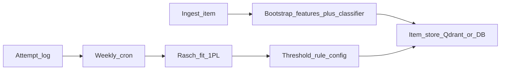

# Difficulty tagging: cold start → weekly Rasch calibration

## Clarification

Throughout this plan, **“Rasch”** means the **1PL item response model** fitted to **correct/incorrect attempts**. If you literally meant **RAG**, that does not replace Rasch for difficulty-from-performance; keep Rasch (or CTT as a simpler interim) for this stage.

## Goals

- **Initial tag:** reproducible, no manual labeling burden (classifier + weak supervision / rules), with explicit **provisional** status.
- **Steady state:** **behavior-grounded** difficulty once enough independent evidence exists.
- **Operations:** **weekly cron**, **versioned** thresholds, auditable history per `item_id`.

## Data you must persist (minimum schema)

Per **item** (e.g. in DB or Qdrant payload alongside vectors):

| Field | Purpose |
|--------|--------|
| `difficulty_label` | `easy` \| `medium` \| `hard` (user-facing) |
| `difficulty_source` | `bootstrap_classifier` \| `bootstrap_rules` \| `rasch` \| `human` |
| `difficulty_confidence` | e.g. 0–1 from classifier or rule strength |
| `calibration_version` | string/int bump when thresholds or model change |
| `attempt_count` | total scored attempts (define “scored”) |
| `unique_answerer_count` | distinct users/sessions (reduces bot skew) |
| `last_rasch_b` | float or null |
| `last_rasch_se` | float or null if available |
| `last_fit_at` | timestamp |

Per **attempt** (append-only event log—Postgres/BigQuery/ClickHouse, not only vectors):

- `attempt_id`, `item_id`, `user_id` (or anonymous `learner_key`), `correct` (bool), `answered_at`, optional `topic_id`, `time_ms`, `device_fingerprint` (abuse), `exam_mode` (if some modes should be excluded from calibration).

**Invariant:** unanswered = **missing**, never treat as incorrect in the response matrix.

## Phase A — Cold start (at ingest / first upsert)

**Inputs:** stem text, options, topic tags, metadata (e.g. has code block, negation cues).

**Pipeline (deterministic given frozen artifacts):**

1. **Feature extraction** (tabular + optional embedding from an open model such as [sentence-transformers](https://www.sbert.net/)): lengths, option count, negation / “except” flags, math/code markers, pairwise option similarity from embeddings, topic one-hot or hash.
2. **Weak labels (no humans):** a **fixed rubric** (YAML/JSON) maps simple patterns to provisional difficulty (e.g. definitional recall + short stem → bias toward easy). This produces `y_weak`.
3. **Classifier:** train **LightGBM / sklearn** on `y_weak` (or a small seed set later). Store **model version** + **feature version** in metadata.
4. **Decision policy:**
   - If classifier confidence high → set `difficulty_label`, `difficulty_source=bootstrap_classifier`.
   - If low confidence → default to **medium** or rules-only; set `difficulty_source=bootstrap_rules`.
5. **Write** `difficulty_label`, `confidence`, `source`, `calibration_version`, counters = 0.

**Why this order:** rules prevent absurd extremes; classifier adds signal beyond regex.

## Phase B — Online collection (always on)

On each graded attempt:

- Append row to **attempt fact table**.
- Increment `attempt_count` and `unique_answerer_count` for that `item_id` (or recompute nightly if you prefer consistency over real-time).

Optional quality filters before counting toward Rasch:

- exclude attempts faster than X ms (guessing)
- cap attempts per user per item per day
- exclude known staff/test accounts

## Phase C — Weekly cron: “maybe refit Rasch”

**Schedule:** weekly job (off-peak), idempotent, logged.

**Step 1 — Select item universe**

- Items with `attempt_count >= N_total` **and** `unique_answerer_count >= N_unique` (your “specific threshold”; typical starting point is **tens to low hundreds** of independent users per item for stable \(b\), but you can start lower with **shrinkage** / wider SE gates).

**Step 2 — Build sparse response matrix**

- Rows = learners in the window (e.g. last 90 days or all-time; pick one policy and version it).
- Columns = items in universe.
- Cells = 1/0, missing if not attempted.

**Step 3 — Fit Rasch (1PL)**

- Use an OSS library ([Girth](https://github.com/eribean/girth) or [py-irt](https://github.com/nd-ball/py-irt)) with a **fixed identification** convention (document which: e.g. mean \(b=0\)).
- Output per item: `b`, optional `SE(b)`, fit diagnostics.

**Step 4 — Map \(b\) → label (rule config)**

- Versioned thresholds in config, e.g. `easy: b < t1`, `medium: t1 ≤ b ≤ t2`, `hard: b > t2`.
- **Promotion rule:** only overwrite `difficulty_label` from Rasch when:
  - item passes attempt thresholds **and**
  - `SE(b)` below cap **or** attempts above a higher “hard lock” threshold **and**
  - optional: item passes discrimination / misfit checks (flag bad items instead of silent relabel).

**Step 5 — Write back**

- Update `last_rasch_b`, `last_rasch_se`, `last_fit_at`, set `difficulty_source=rasch`, bump `calibration_version` if thresholds changed.
- Store **history table** (`item_id`, `old_label`, `new_label`, `b`, `fit_window`, `job_id`) for audit.

**Step 6 — Items below threshold**

- Leave bootstrap label; optionally **nudge** with simple CTT (pass rate) but do not claim Rasch until gates pass.

## Phase D — Governance and safety

- **Frozen configs:** threshold YAML in git; cron reads pinned version.
- **No silent LLM relabeling** in production path if you want non-random semantics; LLM at most for **QA flags**, not authoritative `difficulty_label`.
- **Drift control:** cap max label change magnitude per week unless evidence is overwhelming (prevents oscillation).
- **Cold items:** after long time with no attempts, keep bootstrap + decay confidence in UI copy (“estimated”).

## Architecture sketch

## Suggested default thresholds (tune with your traffic)

- **Bootstrap:** always; label marked provisional in metadata.
- **First Rasch eligibility:** e.g. `unique_answerer_count ≥ 50` AND `attempt_count ≥ 200` (adjust to volume).
- **“High confidence” Rasch label:** add `SE(b)` gate or raise counts to e.g. 200 / 800.

## Deliverables in your repo (when you implement)

- `config/difficulty_thresholds.yaml` — band mapping + eligibility gates + fit window.
- `jobs/weekly_rasch_calibration.py` — extract matrix, fit, write results.
- `pipeline/difficulty_bootstrap.py` — features + classifier load at ingest.
- Migration or Qdrant payload fields for the metadata columns above.

No code changes are implied until you exit plan mode and ask for implementation.
